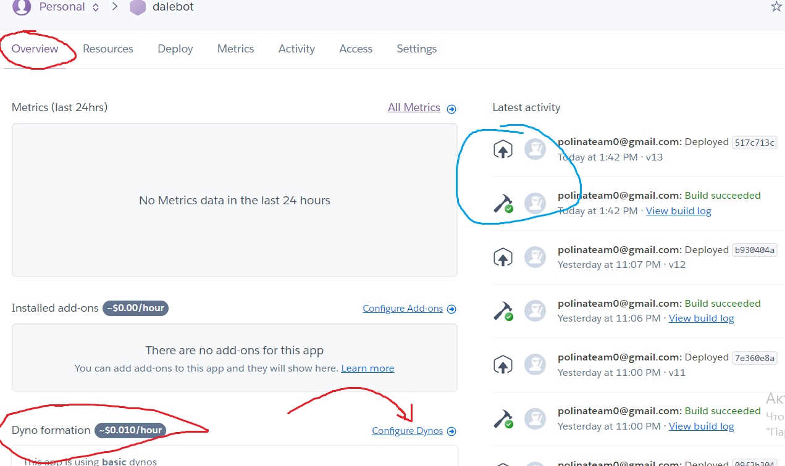
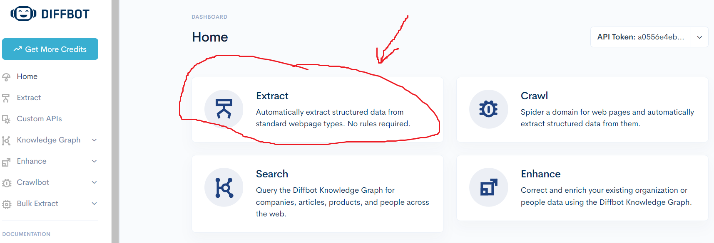
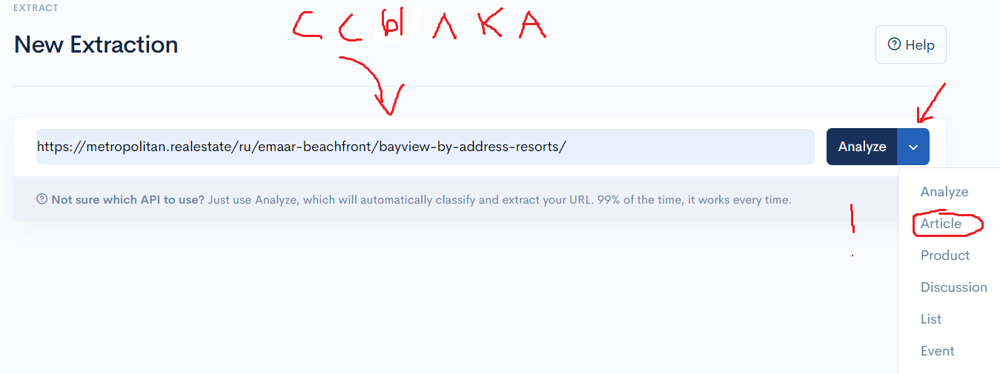
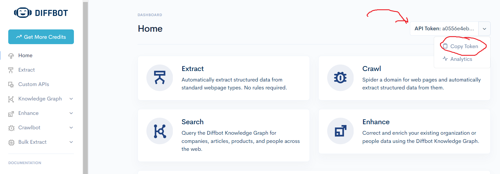

 # БОТ ТРЕБУЕТ ЛОКАЛЬНОГО КЛОНИРОВАНИЯ ДЛЯ ИЗМЕНЕНИЯ ИСХОДНЫХ И ДОБАВЛЕНИЯ НОВЫХ ФАЙЛОВ
# ДЕПЛОЙ ОСУЩЕСТВЛЯЕТСЯ ЧЕРЕЗ КОМАНДНУЮ СТРОКУ(ТЕРМИНАЛ) НА HEROKU 
# ТОЧНО СЛЕДУЙТЕ ШАГАМ, ОПИСАННЫМ НИЖЕ, ДЛЯ УСПЕШНОГО ИЗМЕНЕНИЯ/ДОБАВЛЕНИЯ ФАЙЛОВ БОТА И ДЕПЛОЯ НА HEROKU

## 1. Клонирование репозитория локально
Для того , чтобы вносить изменения и добавлять новые файлы вам необходимо склонировать этот репозиторий локально <br>
Вы можете воспользоваться терминалов в вашем IDE либо открыть командную строку(Win + R, вводим cmd) <br>

### Что делаем:
0. Если у вас не установлен Git, установите его по ссылке https://git-scm.com/downloads (при установке оставьте все по умолчанию)
1. Открываем терминал или командную строку <br>
2. Переходим в папку, в которую мы хотим склонировать репозиторий с помощью команды **cd** <br>
   Например, если я хочу склонировать этот репозиторий в папку C:\Program Files\People, то в терминале(командной строке) я пишу **сd C:\Program Files\People** <br>
3. Авторизуемся в git **если у вас его не было**
      - сначала пишем в строке **git config --global user.name "ваше_имя/любой ник"** <br>
      - потом **git config --global user.email ваш_email.com** <br>
5. Теперь пишем следующее **git clone https://github.com/People-state/DALE_BOT.git** <br>

## 2. Установка и запуск heroku \ Обновление и добавление файлов в приложение
### Вход на HEROKU
1. Heroku имеет двойную защиту, поэтому перед переходом на сайт скачайте на мобильный телефон приложение **Salesforce Authenticator**. **Пока в него не заходим** <br>
2. Перейдите по ссылке https://www.heroku.com/ и зайдите в аккаунт <br> 
     Почта: polinateam0@gmail.com <br>
     Пароль: &5t%)&!bw7#mHRS <br>
3. Heroku попросит вас ввести код защиты, который придет в ваше приложение. **Приложение автоматически поймает код, ничего делать не нужно, просто зайдите в него** <br>
4. **Откройте установленное приложение и введите в Heroku код** <br>
5. После этого вы попадаете в аккаунт<br>

Для работы с этим ботом вам **не нужно** создавать новое веб-приложение на HEROKU. **Работаем в том же терминале локально** <br>
### Поэтому дальше следуйте этим шагам:
1. Установите приложение Heroku по ссылке https://devcenter.heroku.com/articles/heroku-cli (установка по умолчанию) <br>
2. Вводим в терминале **git init** <br>
3. Вводим в терминале **heroku login** и следуем инструкции в терминале. <br>
4. В терминале клонируем приложение с heroku. Вводим следующее **heroku git:clone -a dalebot$ cd dalebot** <br>
5. Теперь мы можем вносить изменения в файл, удалять и добавлять файлы. Для того, чтобы изменения сохранились и отправились на сервер, выполняем следующие команды по очереди: <br>
   ```
      git add .  
      git commit -am "Напишите в ковычки какие изменения вы внесли" 
      git push heroku main 
   ```
6. Если после этого мы хотим снова внести изменения, то для сохранения повторите пункт 5 <br>
#### Если вы закрыли терминал , затем снова открыли и вам снова нужно поработать с этим проектом, то перейдите в терминале в папку(cd путь), куда вы склонировали бот и повторите шаги 3 и 5 <br>

## 3. Запуск/Перезапуск/Проверка приложения на сайте Heroku
1. Heroku имеет двойную защиту, поэтому перед переходом на сайт скачайте на мобильный телефон приложение **Salesforce Authenticator**. **Пока в него не заходим**
2. Перейдите по ссылке https://www.heroku.com/ и зайдите в аккаунт <br>
     Почта: polinateam0@gmail.com
     Пароль: &5t%)&!bw7#mHRS
3. Heroku попросит вас ввести код защиты, который придет в ваше приложение. **Приложение автоматически поймает код, ничего делать не нужно** <br>
4. **Откройте установленное приложение и введите в Heroku код** <br>
5. После этого вы попадает в аккаунт , где в правом верхнем углу есть профиль. Перейдите в него и выберите раздел **Dashboard**, там хранятся наши приложения <br>
6. Заходим в приложение **dalebot** <br>
7. Здесь нам неообходимо найти раздел **Dyno formation** и перейти в **Configure Dynos**. Молоточек справа говорит вам, что все ранее внесенные изменения успешно загружены<br>



8. Сделайте там перезапуск приложение . **Сначала выключите приложение, затем включите** <br>

# ВОЗМОЖНЫЕ ПРИЧИНЫ СБОЯ РАБОТЫ БОТА

## GPT
Необходимо проверить баланс GPT по ссылке https://platform.openai.com/settings/organization/billing/overview <br>
        Данные для входа : <br>
                Почта: peopledoc93@gmail.com <br>
                Пароль: QU9Vqaz-t3c0xD <br>

                
## DIFFBOT
Необходимо проверить есть ли у вас credits для web scrapping статей и текстов на https://app.diffbot.com <br>
        Данные для входа : <br>
                Почта: site@peoplestate.ru <br>
                Пароль: 8i!vxPN9BwDfvS2 <br>

   #### Далее необходимо перейти в следующий раздел <br>
   
    <br>
   
   #### Выбираем функцию article и вставляем любую ссылку со статьей <br>

    <br>

   Если вы получаете ошибку 404 НЕСКОЛЬКО РАЗ, то в таком случае рекомендуется создать новую почту на домене .ru(рабочую) и зарегестрировать ее на сайте diffbot.<br>
   
   ### Что делать после регистрации нового аккаунта на diffbot
   Note: Вам достаточно иметь не более трех аккаунтов diffbot , так как каждый месяц кредиты пополняются! <br>

   1. Вы получите новое API для diffbot <br>

         <br>
        
   2. Скопируйте его и замените в файле config.py переменную DIFFBOT_API_TOKEN (добавлю позднее) <br>
   3. Обновите данные на сервере по инструкции выше и задеплойте новую версию <br>


  ## Все остальные ошибки в работе бота являются следствием неправильного обновления файлов на сервере или неправильного написания кода.
  ## Внимательно проверьте все внесенные изменения, запустите дебагинг в IDE
